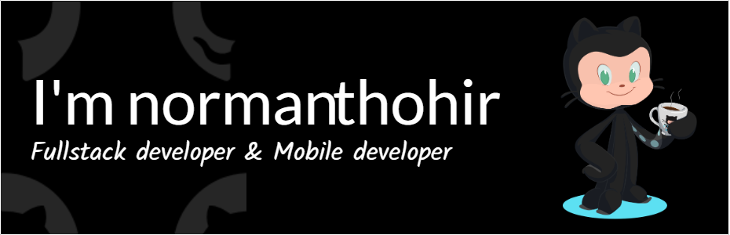

  

## 🌐 Connect With Me

  
  
  

## 🛠 Things I Code With

<picture>
  <source media="(prefers-color-scheme: dark)" srcset="https://raw.githubusercontent.com/normanthohir/normanthohir/output/pacman-contribution-graph-dark.svg">
  <source media="(prefers-color-scheme: light)" srcset="https://raw.githubusercontent.com/normanthohir/normanthohir/output/pacman-contribution-graph.svg">
  
</picture>

###